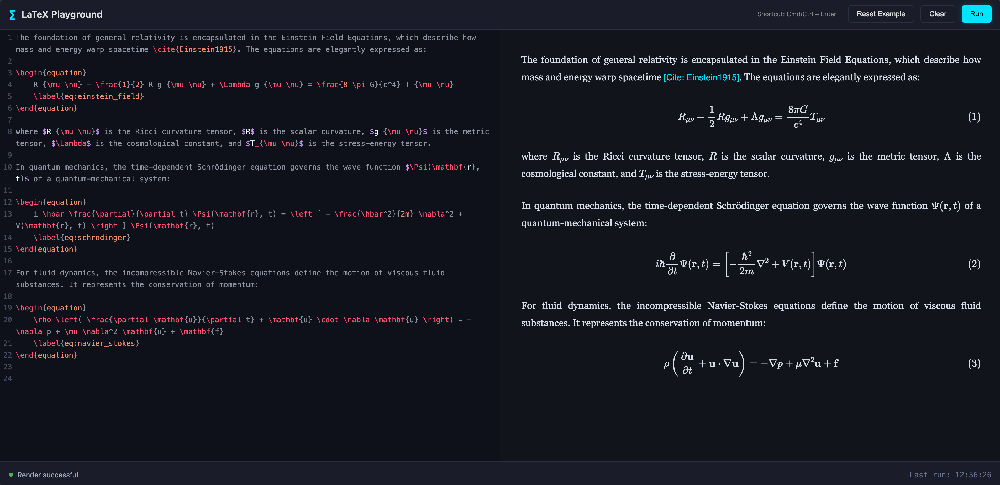

<div align="center"> 
   
   # ⨋ LaTeXBox 

 


**A zero-setup, local sandbox for testing LaTeX code snippets with complex mathematical equations directly in your browser.**

Say goodbye to heavy, gigabyte-sized TeX installations just to test a single equation. **LaTeX-Sandbox** is a sleek, IDE-like environment built for researchers, students, and developers who need to write, execute, and preview LaTeX snippets instantly. </div>

---

## ✨ Why use LaTeXBox?

* 🔒 **100% Local Sandbox:** No backend, no server-side rendering, and no accounts. Your LaTeX code never leaves your machine. It renders entirely within your browser.
* 💸 **Completely Free & Open Source:** No subscriptions, no API keys, no hidden limits. Just pure mathematics.
* 🎨 **Intuitive:** Designed with a modern, dark-mode coding aesthetic (inspired by VSCode/IntelliJ) to keep you focused.
* ⚡ **Zero Setup:** No build steps or installations required. Just open the [⨋LaTeXBox](https://pradeep-vishnu.github.io/LaTeXBox/) file and start typing.

---

## 🚀 Core Features

* **Real-time MathJax 3 Rendering:** Supports complex `\begin{equation}` environments, matrices, inline `$$` variables, and custom macros (like `\argmax`).
* **Smart Cache Reset:** Run your equations as many times as you want. Equation numbers and `\label{}` tags reset cleanly on every execution without colliding.
* **Graceful Error Handling:** Syntax mistake? The app won't crash. It catches missing braces or unclosed environments and gives you **actionable suggested fixes**.
* **Citation Placeholders:** Automatically detects `\cite{}` commands and converts them into clean UI placeholders so your text flows naturally.
* **Pro Editor Shortcuts:** Uses CodeMirror for a true IDE feel. Press `Cmd + Enter` (Mac) or `Ctrl + Enter` (Windows/Linux) to instantly render your code.

---

## 💻 Quick Start

You are literally seconds away from testing your LaTeX snippet. 

1. Online: Click here [⨋LaTeXBox](https://pradeep-vishnu.github.io/LaTeXBox/)


2. **Clone the repository:**
   ```bash
   git clone https://github.com/pradeep-vishnu/LaTeXBox.git

   
